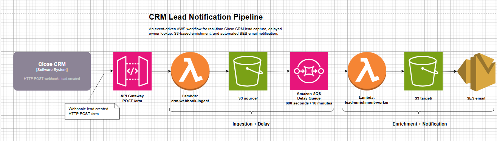
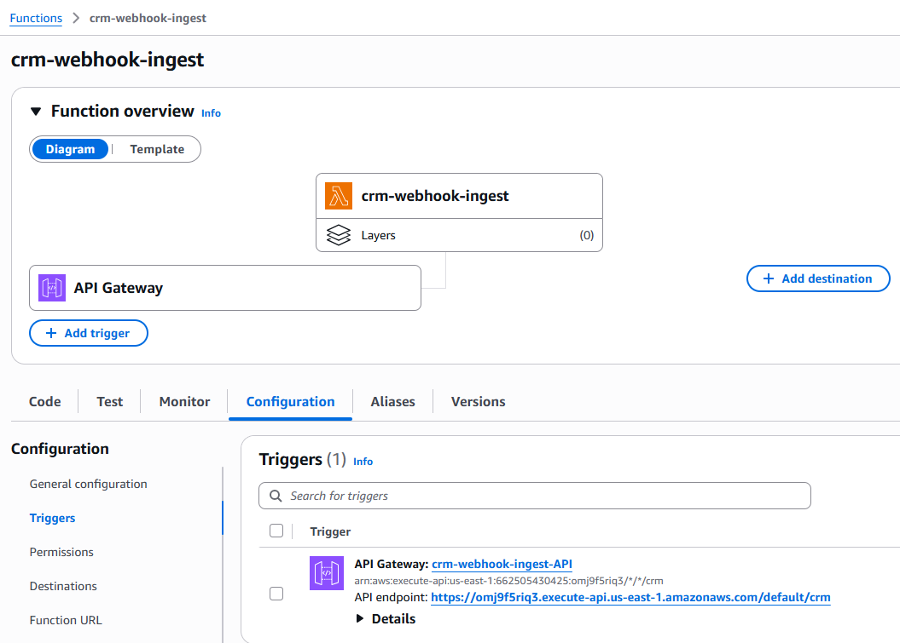
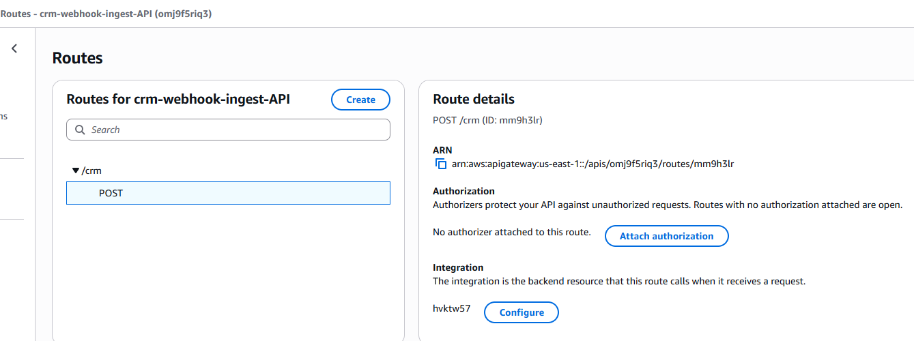
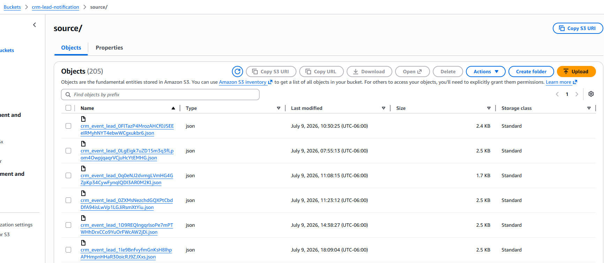
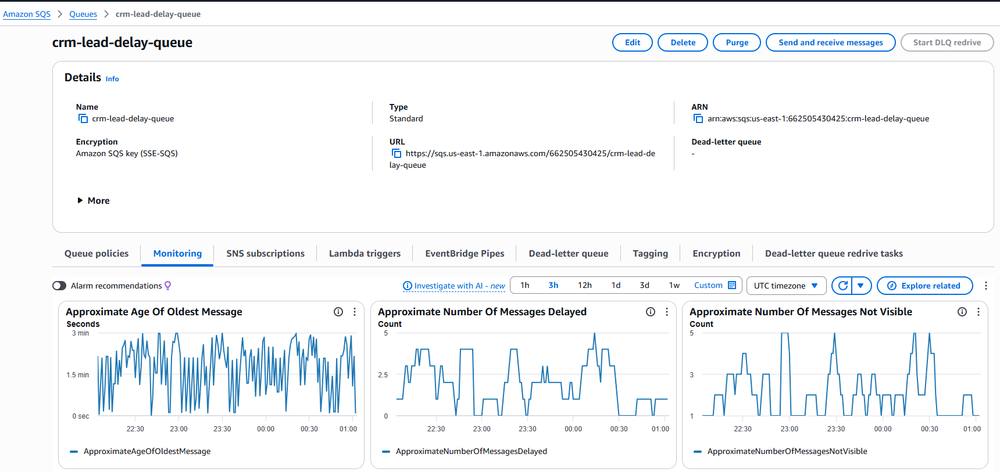
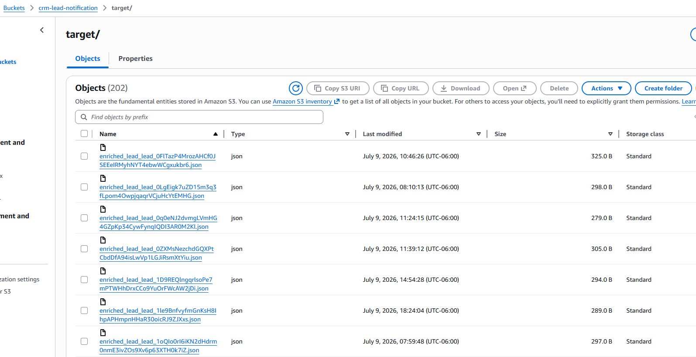
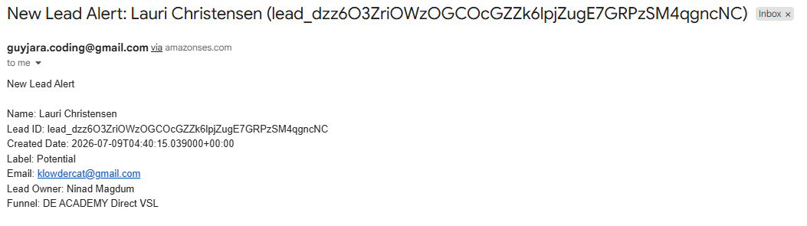

# CRM Lead Notification Pipeline

An event-driven AWS workflow for real-time Close CRM lead capture, delayed owner lookup, S3-based enrichment, and automated SES email notification.

## Architecture



> If the image does not render, confirm the architecture diagram exists at `docs/images/architecture.png` or update the image path to match the exported PNG filename.

## Project Overview

Sales teams need timely notifications when new leads are created in Close CRM. However, lead ownership may not be assigned immediately at creation time. This project solves that problem by capturing new lead-created webhook events in real time, storing the raw event payload, waiting 10 minutes, enriching the lead with owner/contact data, and sending an email notification with the completed lead details.

The completed pipeline performs the following steps:

1. Close CRM sends a `lead.created` webhook event to an AWS API Gateway endpoint.
2. API Gateway invokes the `crm-webhook-ingest` Lambda function.
3. The ingest Lambda parses the webhook body and stores the raw CRM event in S3.
4. The ingest Lambda sends a delayed message to Amazon SQS.
5. SQS waits 10 minutes before making the message available.
6. The `lead-enrichment-worker` Lambda is triggered by SQS.
7. The enrichment Lambda reads the raw CRM event from S3.
8. The enrichment Lambda fetches lead-owner details from the public lead-owner lookup URL.
9. The enrichment Lambda writes the enriched lead record to S3.
10. The enrichment Lambda sends a new-lead email notification through Amazon SES.

## AWS Services Used

| Service | Purpose |
|---|---|
| Close CRM Webhooks | Sends real-time lead-created events to the AWS endpoint. |
| Amazon API Gateway | Provides the public HTTPS webhook endpoint: `POST /crm`. |
| AWS Lambda: `crm-webhook-ingest` | Receives webhook events, stores raw JSON in S3, and sends delayed SQS messages. |
| Amazon S3: `crm-lead-notification` | Stores raw, lookup/test, and enriched JSON files. |
| Amazon SQS: `crm-lead-delay-queue` | Introduces the required 10-minute processing delay. |
| AWS Lambda: `lead-enrichment-worker` | Reads delayed messages, enriches leads, writes target JSON, and sends notifications. |
| Public S3 lead-owner lookup | Provides assigned owner, lead email, and funnel data by `lead_id`. |
| Amazon SES | Sends email notifications containing enriched lead details. |
| Amazon CloudWatch Logs | Captures Lambda execution logs for troubleshooting and validation. |
| IAM | Grants least-necessary access for S3, SQS, and SES operations. |

## Repository Structure

```text
.
├── crm_webhook_ingest/
│   ├── __init__.py
│   └── handler.py
├── lead_enrichment_worker/
│   └── handler.py
├── src/
│   ├── config.py
│   ├── enrich_lead.py
│   ├── notify.py
│   ├── owner_lookup.py
│   ├── parse_close_event.py
│   └── s3_io.py
├── events/
│   ├── sample_api_gateway_event.json
│   ├── sample_close_webhook_body.json
│   ├── sample_owner_lookup.json
│   └── sample_sqs_event.json
├── tests/
│   ├── __init__.py
│   ├── local_test_ingest.py
│   ├── local_test_enrichment_worker.py
│   ├── test_enrich_lead.py
│   ├── test_notify_format.py
│   └── test_parse_close_event.py
├── docs/
│   └── images/
│       └── architecture.png
├── requirements.txt
└── README.md
```

## Data Layout in S3

Primary bucket:

```text
s3://crm-lead-notification/
```

Recommended prefixes:

```text
source/   Raw CRM webhook event payloads
target/   Enriched lead records after delayed processing
lookup/   Temporary local/dev lookup files used before public lookup access was available
```

### Source Object Pattern

Raw CRM events are written as:

```text
s3://crm-lead-notification/source/crm_event_{lead_id}.json
```

Example:

```text
s3://crm-lead-notification/source/crm_event_lead_dzz6O3ZriOWzOGCOcGZZk6lpjZugE7GRPzSM4qgncNC.json
```

### Target Object Pattern

Enriched lead records are written as:

```text
s3://crm-lead-notification/target/enriched_lead_{lead_id}.json
```

Example enriched output:

```json
{
  "display_name": "Lauri Christensen",
  "lead_id": "lead_dzz6O3ZriOWzOGCOcGZZk6lpjZugE7GRPzSM4qgncNC",
  "date_created": "2026-07-09T04:40:15.039000+00:00",
  "status_label": "Potential",
  "lead_email": "klowdercat@gmail.com",
  "lead_owner": "Ninad Magdum",
  "funnel": "DE ACADEMY Direct VSL"
}
```

## Environment Variables

### `crm-webhook-ingest` Lambda

| Variable | Example | Purpose |
|---|---|---|
| `RAW_BUCKET_NAME` | `crm-lead-notification` | S3 bucket where raw CRM events are stored. |
| `DELAY_QUEUE_URL` | `https://sqs.us-east-1.amazonaws.com/<account-id>/crm-lead-delay-queue` | SQS queue URL used for delayed processing. |

### `lead-enrichment-worker` Lambda

| Variable | Example | Purpose |
|---|---|---|
| `OWNER_LOOKUP_MODE` | `public_url` | Uses the production public lead-owner URL. Use `s3` only for local/dev testing. |
| `OWNER_LOOKUP_BUCKET_NAME` | `crm-lead-notification` | Used only when `OWNER_LOOKUP_MODE=s3`. |
| `OWNER_LOOKUP_PREFIX` | `lookup` | Used only when `OWNER_LOOKUP_MODE=s3`. |
| `NOTIFICATION_MODE` | `email` | Sends email notification via SES. Use `disabled` to skip notification. |
| `SES_FROM_EMAIL` | `verified-sender@example.com` | SES-verified sender identity. |
| `NOTIFICATION_TO_EMAIL` | `recipient@example.com` | Notification recipient. In SES sandbox, recipient must also be verified. |

## Setup Steps

### 1. Create the S3 Bucket

Create an S3 bucket for project storage:

```text
crm-lead-notification
```

Create optional visible prefixes in the console:

```text
source/
target/
lookup/
```

The folders do not need to exist before objects are written, but creating them makes the S3 console easier to inspect during testing.

### 2. Create the Ingest Lambda

Create a Python 3.12 Lambda function:

```text
crm-webhook-ingest
```

Handler:

```text
lambda_function.lambda_handler
```

Package contents:

```text
lambda_function.py
src/__init__.py
src/parse_close_event.py
```

The ingest Lambda parses the API Gateway request body, extracts `lead_id`, writes the raw event to S3, and sends a delayed SQS message.

### 3. Create API Gateway Route

Create an HTTP API Gateway route:

```text
POST /crm
```

Attach the route to the `crm-webhook-ingest` Lambda integration.

Example endpoint:

```text
https://<api-id>.execute-api.us-east-1.amazonaws.com/default/crm
```

This URL is provided to the Close CRM SME team for webhook subscription.

### 4. Create the SQS Delay Queue

Create a standard SQS queue:

```text
crm-lead-delay-queue
```

Set message delay to:

```text
600 seconds / 10 minutes
```

This delay gives Close CRM time to assign or update the lead owner before enrichment runs.

### 5. Grant Ingest Lambda Permissions

The `crm-webhook-ingest` execution role needs permission to write raw events to S3 and send messages to SQS.

Example S3 permission:

```json
{
  "Effect": "Allow",
  "Action": ["s3:PutObject"],
  "Resource": "arn:aws:s3:::crm-lead-notification/source/*"
}
```

Example SQS permission:

```json
{
  "Effect": "Allow",
  "Action": ["sqs:SendMessage"],
  "Resource": "arn:aws:sqs:us-east-1:<account-id>:crm-lead-delay-queue"
}
```

### 6. Create the Enrichment Lambda

Create a Python 3.12 Lambda function:

```text
lead-enrichment-worker
```

Handler:

```text
lambda_function.lambda_handler
```

Package contents:

```text
lambda_function.py
src/__init__.py
src/enrich_lead.py
src/owner_lookup.py
src/notify.py
```

The enrichment Lambda reads the raw event from S3, fetches the owner lookup JSON, merges the records, writes the enriched output to S3, and sends an SES email notification.

### 7. Attach SQS Trigger to Enrichment Lambda

Add SQS as a trigger for `lead-enrichment-worker`:

```text
Queue: crm-lead-delay-queue
Batch size: 1
Trigger: enabled
```

### 8. Grant Enrichment Lambda Permissions

The worker execution role needs access to S3, SQS, and SES.

Example S3 permissions:

```json
{
  "Effect": "Allow",
  "Action": ["s3:GetObject"],
  "Resource": "arn:aws:s3:::crm-lead-notification/source/*"
}
```

```json
{
  "Effect": "Allow",
  "Action": ["s3:PutObject"],
  "Resource": "arn:aws:s3:::crm-lead-notification/target/*"
}
```

Example SQS permissions:

```json
{
  "Effect": "Allow",
  "Action": [
    "sqs:ReceiveMessage",
    "sqs:DeleteMessage",
    "sqs:GetQueueAttributes"
  ],
  "Resource": "arn:aws:sqs:us-east-1:<account-id>:crm-lead-delay-queue"
}
```

Example SES permissions:

```json
{
  "Effect": "Allow",
  "Action": [
    "ses:SendEmail",
    "ses:SendRawEmail"
  ],
  "Resource": "*"
}
```

### 9. Configure SES

Create and verify an SES email identity in `us-east-1`.

For SES sandbox mode, use a verified address as both sender and recipient:

```text
SES_FROM_EMAIL=verified-email@example.com
NOTIFICATION_TO_EMAIL=verified-email@example.com
```

## Local Development and Testing

Install dependencies:

```bash
python3.12 -m venv py3_12
source py3_12/bin/activate
pip install -r requirements.txt
```

Run the local ingest test:

```bash
export RAW_BUCKET_NAME=crm-lead-notification
export DELAY_QUEUE_URL="https://sqs.us-east-1.amazonaws.com/<account-id>/crm-lead-delay-queue"
python -m tests.local_test_ingest
```

Run the local enrichment worker test:

```bash
export OWNER_LOOKUP_MODE=s3
export OWNER_LOOKUP_BUCKET_NAME=crm-lead-notification
export OWNER_LOOKUP_PREFIX=lookup
python -m tests.local_test_enrichment_worker
```

For production-style enrichment, use:

```bash
export OWNER_LOOKUP_MODE=public_url
```

## Deployment Packaging

### Package `crm-webhook-ingest`

```bash
rm -rf build
mkdir -p build/src

cp crm_webhook_ingest/handler.py build/lambda_function.py
cp src/parse_close_event.py build/src/parse_close_event.py
touch build/src/__init__.py

cd build
zip -r ../crm_webhook_ingest_deploy.zip .
cd ..
```

Upload `crm_webhook_ingest_deploy.zip` to the `crm-webhook-ingest` Lambda.

### Package `lead-enrichment-worker`

```bash
rm -rf build_enrichment
mkdir -p build_enrichment/src

cp lead_enrichment_worker/handler.py build_enrichment/lambda_function.py
cp src/enrich_lead.py build_enrichment/src/enrich_lead.py
cp src/owner_lookup.py build_enrichment/src/owner_lookup.py
cp src/notify.py build_enrichment/src/notify.py
touch build_enrichment/src/__init__.py

cd build_enrichment
zip -r ../lead_enrichment_worker_deploy.zip .
cd ..
```

Upload `lead_enrichment_worker_deploy.zip` to the `lead-enrichment-worker` Lambda.

## End-to-End Test

Create a synthetic webhook-style event with a real or test lead ID:

```bash
curl -X POST "https://<api-id>.execute-api.us-east-1.amazonaws.com/default/crm" \
  -H "Content-Type: application/json" \
  -d '{"subscription_id":"whsub_test","event":{"id":"ev_test","lead_id":"lead_test_id","action":"created","object_type":"lead","data":{"display_name":"Test Lead","date_created":"2026-07-09T04:40:15.039000+00:00","status_label":"Potential"}}}'
```

Expected immediate result:

```json
{
  "message": "Webhook received, stored, and queued",
  "lead_id": "lead_test_id",
  "s3_key": "source/crm_event_lead_test_id.json",
  "sqs_message_id": "..."
}
```

After the 10-minute SQS delay, confirm an enriched file appears:

```bash
aws s3 ls s3://crm-lead-notification/target/
```

Inspect an enriched file:

```bash
aws s3 cp s3://crm-lead-notification/target/enriched_lead_<lead_id>.json -
```

Expected enriched JSON shape:

```json
{
  "display_name": "...",
  "lead_id": "...",
  "date_created": "...",
  "status_label": "Potential",
  "lead_email": "...",
  "lead_owner": "...",
  "funnel": "DE ACADEMY Direct VSL"
}
```

Confirm that an SES email notification arrives with:

```text
New Lead Alert

Name: ...
Lead ID: ...
Created Date: ...
Label: ...
Email: ...
Lead Owner: ...
Funnel: ...
```

## Testing Evidence

The screenshots below document the key checkpoints in the pipeline, in order of execution.

### 1. Ingest Lambda with API Gateway Trigger

The `crm-webhook-ingest` Lambda is connected to API Gateway and receives incoming Close CRM webhook events.



### 2. API Gateway POST Route

API Gateway exposes the public `POST /crm` route used by the Close CRM webhook subscription.



### 3. S3 Source Folder

Raw CRM webhook events are written to the `source/` prefix using the required `crm_event_{lead_id}.json` naming pattern.



### 4. SQS Lead Delay Queue

The SQS queue introduces the required 10-minute delay before enrichment processing begins.



### 5. S3 Target Folder

The enrichment worker writes final enriched lead records to the `target/` prefix.



### 6. SES Email Notification

Amazon SES sends the final lead notification email containing the enriched lead details.



## Known Caveats

### SES Sandbox and Spam Folder

During testing, Amazon SES may be in sandbox mode. In sandbox mode, both sender and recipient identities usually need to be verified. Test messages sent to Gmail may also be routed to the Spam folder.

### Temporary Local Lookup Folder

During development, the `lookup/` folder in `s3://crm-lead-notification/` was used as a temporary substitute for the public lead-owner lookup. The production workflow uses:

```text
https://dea-lead-owner.s3.us-east-1.amazonaws.com/{lead_id}.json
```

with:

```text
OWNER_LOOKUP_MODE=public_url
```

### Public Lookup Timing

The SQS 10-minute delay is important because the public lead-owner file may not be available immediately when the Close CRM lead-created webhook first arrives.

### Duplicate Lead IDs

If the same `lead_id` is processed more than once, the same S3 object keys are reused and overwritten:

```text
source/crm_event_{lead_id}.json
target/enriched_lead_{lead_id}.json
```

This is acceptable for this project because `lead_id` uniquely identifies the lead event being enriched.

## Status

Completed core functionality:

```text
Close CRM webhook → API Gateway → Lambda → S3 source → SQS delay → Lambda enrichment → public owner lookup → S3 target → SES email notification
```
